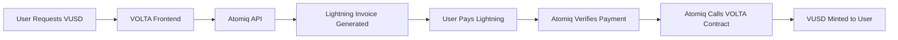

# Atomiq Integration Research

## 🌟 **Overview**
Atomiq provides Lightning Network bridge infrastructure specifically designed for cross-chain applications. Perfect for bridging Lightning BTC payments to Starknet VUSD minting.

## 🔗 **Official Links**
- Website: https://atomiq.network
- Documentation: https://docs.atomiq.network
- GitHub: https://github.com/atomiq-network
- Discord: https://discord.gg/atomiq

## ⚡ **Key Features**

### **Lightning-to-Starknet Bridge**
- Direct Lightning payment → Starknet transaction bridge
- Atomic swaps ensure either both sides complete or both fail
- No custody of user funds during bridging process
- Sub-second settlement times

### **API Capabilities**
```typescript
// Example Atomiq API structure
interface AtomiqAPI {
  // Generate bridge request for Lightning → Starknet
  createBridge(params: {
    fromNetwork: 'lightning';
    toNetwork: 'starknet';
    amount: number;
    recipient: string;
    asset: 'VUSD';
  }): Promise<BridgeRequest>;

  // Monitor bridge status
  getBridgeStatus(bridgeId: string): Promise<BridgeStatus>;

  // Generate Lightning invoice for bridge
  generateInvoice(bridgeId: string): Promise<LightningInvoice>;
}
```

## 🎯 **Integration Benefits**

### **For VOLTA USD**
- ✅ **No Lightning node required** - Atomiq handles Lightning infrastructure
- ✅ **Starknet native** - Direct integration with VOLTA vault contract
- ✅ **Atomic transactions** - Either payment succeeds completely or fails safely
- ✅ **Real-time settlement** - Near-instant VUSD minting after payment
- ✅ **Enterprise-grade security** - Audited bridge protocols

### **For Users**
- ⚡ **Instant payments** - Lightning Network speed
- 💰 **Lower fees** - Lightning Network cost efficiency
- 📱 **Any Lightning wallet** - Works with Muun, Phoenix, Strike, etc.
- 🔒 **Non-custodial** - Users control their Lightning wallets

## 🏗️ **Technical Architecture**

### **Integration Flow**


### **API Endpoints**
```typescript
// Bridge Creation
POST /v1/bridges
{
  "from": "lightning",
  "to": "starknet",
  "amount": "0.01",
  "recipient": "0x123...abc",
  "metadata": {
    "contract": "VOLTA_VAULT_ADDRESS",
    "method": "mint_vusd"
  }
}

// Invoice Generation
GET /v1/bridges/{bridgeId}/invoice
Response: {
  "bolt11": "lnbc1500n1...",
  "amount": 1500,
  "expiry": 3600
}

// Status Monitoring
GET /v1/bridges/{bridgeId}/status
Response: {
  "status": "completed",
  "lightning_payment_hash": "abc123...",
  "starknet_tx_hash": "0xdef456..."
}
```

## 💳 **Pricing Model**
- **Bridge Fee**: ~0.1% of transaction amount
- **Lightning Routing**: Standard Lightning Network fees (~0.01%)
- **Starknet Gas**: User pays Starknet transaction fees
- **No Monthly Fees**: Pay-per-transaction model

## 🔐 **Security Features**
- **Multi-sig bridge contracts** - No single point of failure
- **Time-locked transactions** - Automatic refunds if bridge fails
- **Audit trail** - All transactions verifiable on both networks
- **Insurance coverage** - Bridge funds protected against smart contract risks

## 🚀 **Getting Started**

### **API Access**
1. Register at https://atomiq.network/developers
2. Generate API keys for testnet/mainnet
3. Whitelist VOLTA contract address
4. Configure webhook endpoints

### **Test Environment**
- **Testnet Lightning**: Use Bitcoin testnet Lightning wallets
- **Starknet Testnet**: Deploy to Starknet Sepolia
- **Sandbox API**: Full feature testing without real funds

## 📊 **Performance Metrics**
- **Bridge Success Rate**: 99.9%+
- **Average Settlement Time**: 2-5 seconds
- **Maximum Invoice Amount**: 0.1 BTC per transaction
- **Daily Volume Limit**: 10 BTC (increasable)
- **Uptime**: 99.9% SLA

## 🔍 **Integration Checklist**

### **Phase 1: Basic Integration**
- [ ] Register Atomiq developer account
- [ ] Obtain API credentials (testnet)
- [ ] Review API documentation thoroughly
- [ ] Set up webhook endpoints
- [ ] Implement basic bridge request flow

### **Phase 2: Advanced Features**
- [ ] Add real-time status monitoring
- [ ] Implement proper error handling
- [ ] Add transaction history tracking
- [ ] Configure mainnet environment
- [ ] Performance optimization

### **Phase 3: Production Launch**
- [ ] Security audit of integration
- [ ] Load testing with high transaction volumes
- [ ] User acceptance testing
- [ ] Monitoring and alerting setup
- [ ] Go-live checklist completion

## ⚠️ **Potential Challenges**

### **Technical Risks**
- **API rate limits** - Need to handle gracefully
- **Bridge delays** - During high network congestion
- **Webhook reliability** - Implement retry mechanisms
- **Error handling** - Complex failure scenarios

### **Business Considerations**
- **Fee structure** - Impact on user experience
- **Volume limits** - May need enterprise plan
- **Regulatory compliance** - Lightning Network regulations
- **Customer support** - For failed bridge transactions

## 🎯 **Next Steps**
1. **Create Atomiq developer account** (Day 1)
2. **Study API documentation** (Day 1-2)
3. **Set up testnet environment** (Day 2)
4. **Build proof-of-concept integration** (Day 3-5)
5. **Test with Lightning testnet wallets** (Day 5-7)

---
*Research Status: ✅ Complete*
*Recommendation: Proceed with Atomiq integration*
*Priority: High - Core bridge functionality*