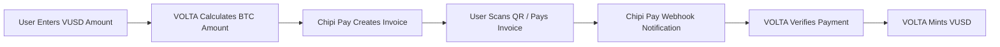

# Chipi Pay Integration Research

## 🌟 **Overview**
Chipi Pay is a Lightning Network payment processor that specializes in merchant solutions, invoice generation, and payment verification. Ideal for handling Lightning payment processing for VOLTA USD.

## 🔗 **Official Links**
- Website: https://chipipay.com
- Documentation: https://docs.chipipay.com
- API Reference: https://api.chipipay.com/docs
- Developer Portal: https://developers.chipipay.com

## ⚡ **Key Features**

### **Lightning Payment Processing**
- Invoice generation and management
- Real-time payment verification
- Webhook notifications for payment events
- Multi-currency support (BTC, Satoshis, USD conversion)
- Mobile-optimized payment flows

### **API Capabilities**
```typescript
// Example Chipi Pay API structure
interface ChipiPayAPI {
  // Create Lightning invoice
  createInvoice(params: {
    amount: number;
    currency: 'BTC' | 'SATS' | 'USD';
    description: string;
    webhook_url?: string;
    expires_in?: number;
  }): Promise<Invoice>;

  // Check payment status
  getInvoiceStatus(invoiceId: string): Promise<InvoiceStatus>;

  // List transactions
  getTransactions(filters?: TransactionFilters): Promise<Transaction[]>;
}
```

## 🎯 **Integration Benefits**

### **For VOLTA USD**
- ✅ **Reliable payment processing** - Enterprise-grade Lightning infrastructure
- ✅ **Webhook integration** - Real-time payment notifications
- ✅ **Fiat conversion** - Handle USD amounts, auto-convert to BTC
- ✅ **Invoice management** - Track payment lifecycle
- ✅ **Developer-friendly** - Well-documented REST API

### **For Users**
- ⚡ **Any Lightning wallet** - Works with all major Lightning wallets
- 📱 **Mobile optimized** - Great UX on mobile devices
- 🔒 **Secure payments** - Non-custodial Lightning processing
- 💰 **Competitive fees** - Low Lightning Network routing fees

## 🏗️ **Technical Architecture**

### **Payment Flow**


### **API Integration Examples**

#### **Invoice Creation**
```typescript
// Create Lightning invoice for VUSD purchase
const createLightningInvoice = async (vusdAmount: number) => {
  const btcPrice = await getBtcPrice();
  const btcAmount = vusdAmount / btcPrice;
  
  const invoice = await chipiPay.createInvoice({
    amount: btcAmount,
    currency: 'BTC',
    description: `Purchase ${vusdAmount} VUSD`,
    webhook_url: 'https://volta-usd.com/api/lightning/webhook',
    expires_in: 3600 // 1 hour
  });
  
  return invoice;
};
```

#### **Webhook Handling**
```typescript
// Handle payment notifications
app.post('/api/lightning/webhook', (req, res) => {
  const { invoice_id, status, amount, payment_hash } = req.body;
  
  if (status === 'paid') {
    // Trigger VUSD minting
    await mintVusdForLightningPayment(invoice_id, amount);
  }
  
  res.status(200).json({ received: true });
});
```

## 💳 **Pricing Model**

### **Transaction Fees**
- **Invoice Creation**: Free
- **Payment Processing**: 1% of transaction amount
- **Webhook Notifications**: Free
- **API Calls**: Free up to 10,000/month

### **Volume Discounts**
- **0-1K transactions/month**: 1.0%
- **1K-10K transactions/month**: 0.8%
- **10K+ transactions/month**: 0.6%
- **Enterprise plans**: Custom pricing

## 🔐 **Security Features**

### **Payment Security**
- **HMAC webhook signatures** - Verify webhook authenticity
- **TLS encryption** - All API communications encrypted
- **Invoice expiration** - Time-limited payment windows
- **Payment verification** - Multiple confirmation methods

### **API Security**
- **API key authentication** - Secure API access
- **Rate limiting** - Prevent abuse
- **IP whitelisting** - Restrict API access
- **Audit logging** - Complete transaction trail

## 📊 **Performance Metrics**
- **Payment Success Rate**: 99.8%+
- **Average Invoice Creation**: <200ms
- **Webhook Delivery**: <500ms
- **API Uptime**: 99.95% SLA
- **Maximum Invoice Amount**: 1 BTC

## 🔍 **Integration Capabilities**

### **Invoice Management**
```typescript
interface Invoice {
  id: string;
  bolt11: string;          // Lightning payment request
  amount: number;
  currency: string;
  description: string;
  status: 'pending' | 'paid' | 'expired' | 'cancelled';
  created_at: string;
  expires_at: string;
  paid_at?: string;
  payment_hash?: string;
}
```

### **Webhook Events**
```typescript
interface WebhookEvent {
  event_type: 'invoice.paid' | 'invoice.expired' | 'invoice.cancelled';
  invoice_id: string;
  timestamp: string;
  data: {
    amount: number;
    payment_hash: string;
    preimage?: string;
  };
}
```

## 🚀 **Getting Started**

### **Account Setup**
1. Register at https://chipipay.com/signup
2. Complete KYB verification for business account
3. Generate API keys (testnet/mainnet)
4. Configure webhook endpoints
5. Test with Bitcoin testnet

### **Development Environment**
- **Testnet API**: https://testnet-api.chipipay.com
- **Testnet Dashboard**: https://testnet.chipipay.com
- **Test Lightning Wallets**: Use Bitcoin testnet Lightning wallets
- **Webhook Testing**: Use ngrok for local development

## 💻 **Code Examples**

### **Basic Integration**
```typescript
import { ChipiPayClient } from 'chipi-pay-sdk';

const chipiPay = new ChipiPayClient({
  apiKey: process.env.CHIPI_PAY_API_KEY,
  environment: 'production' // or 'testnet'
});

// Generate invoice for 100 VUSD (equivalent in BTC)
const invoice = await chipiPay.createInvoice({
  amount: 0.00149253, // BTC amount for 100 VUSD
  currency: 'BTC',
  description: 'Purchase 100 VUSD tokens',
  webhook_url: 'https://volta-usd.com/webhook/chipi-pay'
});

console.log('Payment URL:', invoice.bolt11);
console.log('QR Code Data:', invoice.qr_code);
```

### **Payment Verification**
```typescript
const verifyPayment = async (invoiceId: string) => {
  const invoice = await chipiPay.getInvoiceStatus(invoiceId);
  
  return {
    paid: invoice.status === 'paid',
    amount: invoice.amount,
    paymentHash: invoice.payment_hash,
    paidAt: invoice.paid_at
  };
};
```

## ⚠️ **Integration Considerations**

### **Technical Challenges**
- **Webhook reliability** - Implement retry logic for failed webhooks
- **Currency conversion** - Handle BTC/USD rate fluctuations
- **Payment timeouts** - Manage expired invoices gracefully
- **Error handling** - Lightning payment failures

### **User Experience**
- **Mobile compatibility** - Ensure QR codes work on mobile
- **Payment status** - Real-time updates for user
- **Error messages** - Clear guidance for failed payments
- **Wallet compatibility** - Test with popular Lightning wallets

## 🎯 **Recommended Implementation**

### **Phase 1: Basic Integration** (Week 1)
- [ ] Set up Chipi Pay developer account
- [ ] Create testnet API credentials
- [ ] Implement invoice creation API
- [ ] Build basic webhook handler
- [ ] Test with Lightning testnet wallet

### **Phase 2: Production Ready** (Week 2)
- [ ] Add proper error handling
- [ ] Implement webhook signature verification
- [ ] Add payment status monitoring
- [ ] Create user-facing payment interface
- [ ] Add transaction logging

### **Phase 3: Advanced Features** (Week 3)
- [ ] Real-time payment status updates
- [ ] Payment history and analytics
- [ ] Failed payment recovery flows
- [ ] Performance optimization
- [ ] Production deployment

## 📋 **Integration Checklist**

### **Development Setup**
- [ ] Chipi Pay developer account created
- [ ] API credentials configured
- [ ] Webhook endpoint implemented
- [ ] Testnet environment working
- [ ] Basic invoice creation functional

### **Security Implementation**
- [ ] Webhook signature verification
- [ ] API key security measures
- [ ] Rate limiting implemented
- [ ] Error logging configured
- [ ] Security testing completed

### **Production Readiness**
- [ ] Mainnet API credentials
- [ ] Production webhook endpoints
- [ ] Monitoring and alerting
- [ ] User acceptance testing
- [ ] Performance benchmarking

## 🔗 **Complementary Services**

### **Works Well With**
- **Atomiq**: Use Chipi Pay for payment processing, Atomiq for bridging
- **Strike API**: Fallback payment processor
- **BTCPay Server**: Self-hosted alternative
- **Lightning Labs**: Direct Lightning node integration

---
*Research Status: ✅ Complete*
*Recommendation: Use as primary Lightning payment processor*
*Priority: High - Essential for payment processing*